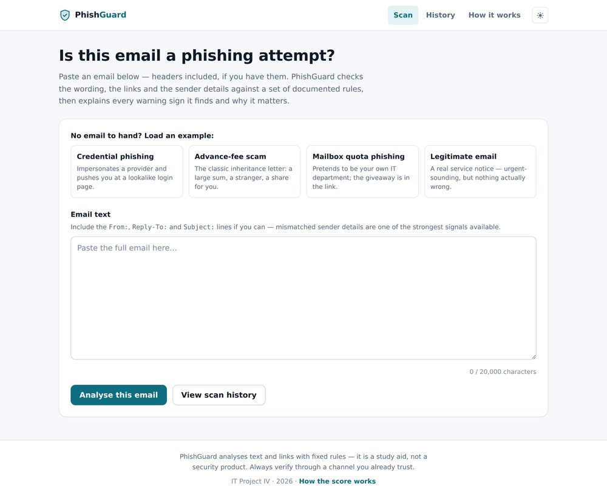
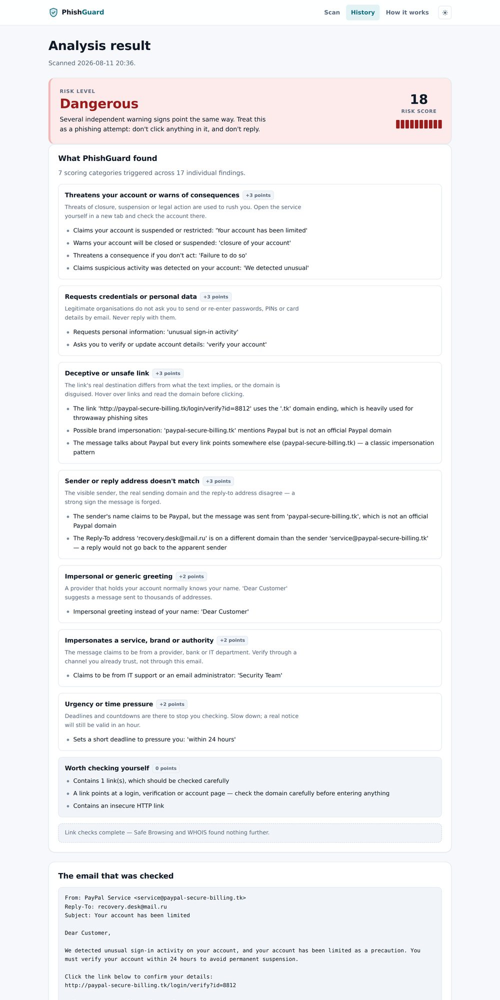

# PhishGuard

A web app that tells you whether a pasted email is a phishing attempt — and, more
importantly, *why*. Paste an email, get a Safe / Suspicious / Dangerous verdict, a
score, and a plain-English list of every warning sign found, grouped by what kind
of trick it is. Every scan is saved so it can be reviewed, annotated and exported.

**Live at https://phishguard-qbkm.onrender.com** — running on Render's free tier, so
the first request after an idle period takes up to a minute while the instance wakes,
and scan history is cleared whenever it spins down or redeploys. See
[Deployment](#deployment-render).

Built for **IT Project IV** (student: Abhiram; instructor: Dr. Denilton Luiz Darold).
There is no machine-learning model here: the detection is a documented set of rules,
and the accuracy claims below come with the script that reproduces them.





More screenshots: [scan history](docs/screenshots/history.jpg) ·
[how the score works](docs/screenshots/how-it-works.jpg) ·
[dark mode](docs/screenshots/result-dark.jpg) ·
[on a phone](docs/screenshots/history-mobile.jpg)

---

## Results at a glance

Measured with `evaluate_dataset.py` against real, public email corpora. The
phishing-focused benchmark is the headline one — it is scope-matched to what
PhishGuard is built to detect, and the rules were tuned on a **disjoint** split
from the one reported here.

| Benchmark | Emails | Accuracy | Precision | Recall | F1 | False positives |
|---|---|---|---|---|---|---|
| **Phishing-focused (holdout)** | 3,000 | **89.53%** | **97.06%** | **81.53%** | **88.62%** | 2.47% of legitimate |
| Phishing-focused (tuning split) | 3,000 | 88.90% | 96.57% | 80.67% | 87.90% | 2.87% of legitimate |
| Mixed-source (spam included) | 4,000 | 52.55% | 82.74% | 13.13% | 22.66% | 3.08% of legitimate |
| Kaggle templated set | 800 | 100.00% | 100.00% | 100.00% | 100.00% | 0.00% |
| Legitimate-marketing stress test | 10 | 100.00% | — | — | — | **0 of 10** |

Two of those numbers need their context stated rather than buried:

- **The mixed-source benchmark looks terrible, and that is the honest headline for
  it.** 88.5% of what it labels "phishing" is generic commercial spam — pharmacy
  ads, stock pump-and-dumps, replica goods — not credential theft or financial
  fraud. Recall on that spam is 4.5%; recall on the actual phishing inside the same
  benchmark is 79.8%. `python scripts/breakdown.py` prints that split per corpus.
  PhishGuard is a phishing detector, not a spam filter, and the aggregate number is
  measuring the wrong thing rather than revealing a hidden weakness.
- **The Kaggle set's 100% means very little.** All 800 rows are repeats of just 8
  unique sentences. Full coverage of 8 sentences is not evidence of real-world
  accuracy; it is kept only because it was the project's original evidence artifact.

### What changed, and by how much

The first version of the detector scored a single point for any one matched phrase.
Rebuilding it around weighted categories with a calibrated threshold moved it a long
way in both directions at once:

| | Before | After |
|---|---|---|
| Recall (phishing-focused benchmark) | 11.47% | **81.53%** |
| Precision | 82.37% | **97.06%** |
| F1 | 20.14% | **88.62%** |
| False positives on legitimate marketing email | 40% (4 of 10) | **0%** |
| Automated tests | 75 | **198** |

---

## Running it

```bash
python -m venv venv
source venv/bin/activate        # Windows: venv\Scripts\activate
pip install -r requirements.txt
python app.py                   # http://127.0.0.1:5000
```

That is the whole setup. No API keys, no database server, no internet connection
required — everything that produces the numbers above runs offline.

### Configuration

Every one of these is optional.

| Variable | Default | What it does |
|---|---|---|
| `SECRET_KEY` | random per start | Signs CSRF tokens. Set it in any real deployment, or open forms break on restart. |
| `PHISHGUARD_DB` | `phishguard.db` | Where the SQLite file lives. Point it at a mounted disk in production. |
| `SAFE_BROWSING_API_KEY` | unset | Enables the [Google Safe Browsing](https://developers.google.com/safe-browsing) check. Without it that check is skipped silently; everything else, including the WHOIS domain-age check, still works. |
| `FLASK_DEBUG` | `0` | `1` enables the debugger. **Development only** — it allows arbitrary code execution. |
| `PORT` | `5000` | Port for the development server. |

### Tests and linting

```bash
pip install -r requirements-dev.txt
pytest            # 198 tests, no network access, ~1s
ruff check .
```

### Reproducing the benchmarks

```bash
python build_realistic_dataset.py          # downloads ~140MB of public corpora, writes 3 CSVs
python evaluate_dataset.py data/realistic_phishing/phishing_focused_holdout.csv --quiet
python evaluate_dataset.py data/realistic_phishing/realistic_emails.csv --quiet
python evaluate_dataset.py "data/kaggle_phishing_email/phishing_dataset (1).xlsx" --quiet
python evaluate_dataset.py sample_data/legitimate_marketing_emails.csv --quiet

python scripts/calibrate.py                # the threshold sweep behind the chosen cut-offs
python scripts/calibrate.py --rules        # per-rule hit rate on phishing vs legitimate mail
python scripts/breakdown.py                # recall per source corpus
```

The sampling is seeded, so the CSVs are byte-identical on every machine.
`docs/evaluation.md` has the full methodology, the corpora, and the reasoning.

---

## How the detection works

```
phishguard/
  rules.py       what to look for: 30 rules across 12 weighted categories
  urls.py        URL and domain inspection — spoofing, homographs, typo-squats
  headers.py     sender-header consistency (From vs Reply-To vs display name)
  scoring.py     combine matches into findings, a score and a risk level
  network.py     Safe Browsing + WHOIS — the only module that touches the network
  validation.py  is this input analysable at all
```

**Rules are declarative.** Each is an id, a category, a regular expression and the
sentence shown to the user. Adding a check is adding a row, and every rule can be
measured on its own with `scripts/calibrate.py --rules`.

**Categories carry the weight, not rules.** A phishing email usually repeats one
idea several ways — "verify your account", "confirm your details", "update your
records". Scoring each phrasing separately let a single theme dominate the score, so
each *category* now contributes its weight at most once per email. The score
approximates how many **independent** reasons there are to distrust a message.

| Points | Categories |
|---|---|
| 3 | Credential requests · Account threats · Deceptive links · Advance-fee framing · Prize scams · Risky attachments · Sender mismatch |
| 2 | Impersonation · Urgency · Impersonal greeting |
| 1 | Unusual reply channel |
| 0 | Informational (shown, never scored) |

**Thresholds:** below 3 → Safe, 3–5 → Suspicious, 6+ → Dangerous.

The Suspicious threshold being above 1 is the single most important calibration
decision. It means one weak signal on its own — an impersonal greeting, one urgent
phrase — is reported to the reader but is not enough to call an email phishing.
That is what took false positives on legitimate marketing email from 40% to zero,
and it cost about 2 points of F1 relative to the most aggressive setting. The full
sweep is in `docs/evaluation.md`.

### How the rules were chosen

Every rule was measured against the corpora before being kept: how often it fires on
real phishing versus real legitimate business mail. The comments in `rules.py` record
each rule's measured rates. Two rules were measured and **rejected**, and the
reasoning is kept in the file so it isn't rediscovered later:

- *International phone/fax number* (5.8% phishing / 0.9% legitimate) — every
  legitimate match was an ordinary European business signature. It only separated
  the classes when narrowed to specific country dialling codes, which is geographic
  profiling rather than phishing detection.
- *Words spaced out to evade filters* (0.2% / 0.3%) — fired **more** often on
  legitimate mail than phishing, so it carried no signal at all.

### What it deliberately doesn't score

"This email contains links" and "this email contains an insecure HTTP link" are
shown but never scored. Almost every real email contains a link; scoring these
flagged ordinary mailing-list and newsletter mail as phishing, and was the single
largest source of false positives in the first version (20.3% → 2.5% when removed).

### What it can't do

PhishGuard can only find what it was told to look for. A carefully written phishing
email that avoids every phrase in the rule set will come back **Safe**. A low score
means "nothing obvious found" — never "this email is genuine". Fixed rules will
always lose to a learned model on novel phrasing; that trade is deliberate here
(the rules are inspectable and explain themselves), and ML classification is
explicitly out of scope for the project.

---

## Features

- **Scan** — paste an email, headers optional; get a verdict, a score and grouped,
  explained findings with advice per category.
- **Sender-header analysis** — display name vs. real sending domain vs. Reply-To.
  A forged email routinely disagrees with itself here; genuine mail rarely does.
- **Live link intelligence** — Google Safe Browsing and WHOIS domain age, fetched in
  the background after the page renders so a slow lookup never blocks the result.
- **Scan history (full CRUD)** — every scan saved, searchable, filterable by risk
  level, annotatable with a note, deletable, exportable as CSV or JSON.
- **Sample emails** — four one-click examples (credential phishing, advance-fee
  scam, mailbox-quota phishing, and a legitimate email) so the app can be
  demonstrated without hunting for real phishing.
- **"How it works" page** — generated from the same category registry the detector
  scores against, so the explanation can't drift from the rules.
- **Responsive, accessible, dark-mode UI** — no external fonts or frameworks, so it
  works offline. The history table becomes a card stack on a phone; the risk level
  is conveyed by word, number and meter, not colour alone.
- **Operational bits** — `/healthz`, rate limiting, CSRF protection, friendly 404 /
  429 / 500 pages, automatic schema migration for databases from older versions.

---

## Security notes

- **CSRF protection** on every form (Flask-WTF). An expired token gets an
  explanatory page rather than a bare 400.
- **Rate limiting** — 20 requests/minute/IP on scanning and link checks, to protect
  the Safe Browsing quota and avoid hammering WHOIS servers. Storage is in-memory,
  which is correct for this single-process app and would need Redis behind multiple
  workers.
- **Stored email bodies are attacker-controlled text** and are escaped by Jinja
  autoescaping, never rendered as markup. There's a test for it.
- **Input is bounded** at 20,000 characters, validated before anything is analysed
  or written to the database.
- **No outbound calls during analysis** except the two explicit, opt-in link checks.

---

## Deployment (Render)

Deployed at **https://phishguard-qbkm.onrender.com**, on Render's free tier in the
Frankfurt region, building from `main`.

The service is configured with the same settings `render.yaml` describes — build
`pip install -r requirements-render.txt`, start `gunicorn app:app`, `PYTHON_VERSION`
3.12.7, a generated `SECRET_KEY` — so **New → Blueprint** on this repo reproduces it.
`SAFE_BROWSING_API_KEY` is left unset, which skips that one check silently; everything
else, including the WHOIS domain-age check, still runs.

Three things specific to the free tier:

- **The development server is never used in production.** Render runs
  `gunicorn app:app`. Gunicorn lives in `requirements-render.txt` rather than
  `requirements.txt` because it is Unix-only and would break `pip install` on the
  Windows machine this is developed on.
- **The instance spins down after 15 minutes without traffic.** The next request wakes
  it, which takes up to a minute. Nothing is wrong; it is cold-starting.
- **Scan history does not persist.** Free web services have an ephemeral filesystem and
  no persistent-disk option, so the SQLite file is lost on redeploy and on spin-down.
  Fine for demonstrating the analysis end to end; set `PHISHGUARD_DB` to a path on a
  mounted disk (paid plan) or swap SQLite for a hosted database if history has to
  survive. Persistence itself works — it is demonstrated across a server restart on a
  local run.

---

## Datasets and credits

- **Kaggle**: [Phishing Email Dataset](https://www.kaggle.com/datasets/tommyf1/phishing-email-dataset) (MIT).
- **Real corpora**, compiled by [rokibulroni/Phishing-Email-Dataset](https://github.com/rokibulroni/Phishing-Email-Dataset):
  Enron-Spam (business email), CEAS 2008 Spam Challenge, Apache SpamAssassin public
  corpus, Jose Nazario's phishing corpus, and a Nigerian advance-fee fraud corpus.

`data/` is gitignored — the corpora are third-party and rebuildable with
`python build_realistic_dataset.py`.

## Further reading

- [`docs/architecture.md`](docs/architecture.md) — module map and the path a scan takes
- [`docs/evaluation.md`](docs/evaluation.md) — full benchmark methodology and results
- [`docs/submission-checklist.md`](docs/submission-checklist.md) — course deliverables
